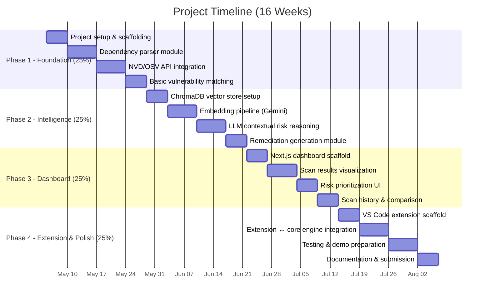

# 🛡️ AI-Powered Vulnerability Detection & Mitigation System
## Work Plan & Initial 25% Milestone

---

## 1. Project Understanding (TL;DR)

Your major project is an **AI-driven dependency vulnerability analyzer** that:
1. **Ingests** a GitHub repo → parses `package.json`, `pom.xml`, `requirements.txt`
2. **Detects** CVEs by cross-referencing dependencies against NVD / Snyk / OSV databases
3. **Embeds** vulnerability descriptions into a vector store (ChromaDB) for semantic retrieval
4. **Reasons** with an LLM to prioritize risks contextually (beyond raw CVSS scores)
5. **Generates** actionable remediation (upgrade paths, alternative packages, mitigations)
6. **Presents** everything in an interactive dashboard

**Final vision:** A working product convertible into a **VS Code extension**.

---

## 2. Strategic Tech Stack Decision

> [!IMPORTANT]
> Your synopsis specifies **Spring Boot + React + PostgreSQL**. However, since your final goal is a VS Code extension, I recommend pivoting the core engine to **Node.js / TypeScript**. Here's why:

| Concern | Spring Boot (Java) | Node.js / TypeScript |
|---|---|---|
| VS Code Extension | Extensions are JS/TS only — you'd need to rewrite or maintain a separate backend | **Native fit** — core logic runs directly in the extension |
| Development speed | Heavier boilerplate, separate build tooling | Faster iteration, single language stack |
| Dependency parsing | Need Java XML/JSON libs | `npm` ecosystem has parsers for everything |
| Academic presentation | Can still demo as web app | Can demo as **both** web app AND extension |
| Team skill requirement | Java + JS + SQL | JS/TS across the board |

### Recommended Stack (Pragmatic & Extension-Ready)

```
┌─────────────────────────────────────────────────┐
│                  FRONTEND                       │
│  Next.js 14 (App Router) + shadcn/ui            │
│  OR → VS Code Webview (same React components)   │
└──────────────────────┬──────────────────────────┘
                       │ REST / tRPC
┌──────────────────────▼──────────────────────────┐
│                  BACKEND                        │
│  Node.js + TypeScript                           │
│  Express / Fastify API (or tRPC)                │
│  Core scanning engine as a standalone package   │
└──────────┬───────────┬──────────────────────────┘
           │           │
   ┌───────▼──┐  ┌─────▼─────────────┐
   │ SQLite / │  │ ChromaDB          │
   │ Postgres │  │ (Vector Store)    │
   │ (prisma) │  │ via Docker        │
   └──────────┘  └───────────────────┘
           │
   ┌───────▼──────────────────────────┐
   │  External APIs                   │
   │  • OSV.dev (free, no key needed) │
   │  • NIST NVD API (free, key rec.) │
   │  • GitHub REST API               │
   │  • Gemini API (free tier LLM)    │
   └──────────────────────────────────┘
```

> [!TIP]
> By building the **core scanning engine as an independent npm package**, you can import it into:
> - A Next.js web dashboard (for academic demo & presentation)
> - A VS Code extension (for the real product)
> - A CLI tool (for CI/CD pipelines)

---

## 3. Resources & APIs to Set Up (Do This First)

### 🔑 API Keys & Accounts to Register

| Resource | URL | Cost | Action |
|---|---|---|---|
| **NIST NVD API** | https://nvd.nist.gov/developers/request-an-api-key | Free | Request API key (increases rate limit from 5 → 50 req/30s) |
| **OSV.dev API** | https://osv.dev/docs/ | Free, no key | No signup needed — use directly |
| **GitHub Personal Access Token** | https://github.com/settings/tokens | Free | Create a PAT with `repo` scope for reading manifests |
| **Google Gemini API** | https://aistudio.google.com/apikey | Free tier (15 RPM) | Get API key for LLM reasoning & embeddings |
| **Snyk API** *(optional)* | https://snyk.io/product/vulnerability-database/ | Free tier | Sign up if you want a second data source |

### 📦 Core NPM Packages to Research

| Package | Purpose |
|---|---|
| `octokit` / `@octokit/rest` | GitHub API client for fetching repo files |
| `chromadb` | Vector store client for semantic retrieval |
| `@google/generative-ai` | Gemini API SDK for embeddings + reasoning |
| `prisma` | Type-safe ORM for PostgreSQL/SQLite |
| `semver` | Version comparison & range matching |
| `fast-xml-parser` | Parse `pom.xml` Maven files |
| `toml` | Parse `Cargo.toml` (Rust — bonus ecosystem) |
| `@vscode/vsce` | VS Code extension packaging (later phase) |
| `yo generator-code` | VS Code extension scaffolding |

### 📚 Key Documentation to Study

| Topic | Resource |
|---|---|
| NVD API Docs | https://nvd.nist.gov/developers/vulnerabilities |
| OSV API Specification | https://google.github.io/osv.dev/api/ |
| GitHub Contents API | https://docs.github.com/en/rest/repos/contents |
| ChromaDB JS Guide | https://docs.trychroma.com/docs/languages/js-client |
| Gemini Embeddings | https://ai.google.dev/gemini-api/docs/embeddings |
| VS Code Extension API | https://code.visualstudio.com/api |
| Red Hat Dep Analytics (reference ext.) | https://github.com/fabric8-analytics/fabric8-analytics-vscode-extension |

### 🧪 Test Repositories (Intentionally Vulnerable)

Use these to validate your scanner works:
- **OWASP Juice Shop** — `https://github.com/juice-shop/juice-shop` (Node.js, many known CVEs)
- **OWASP WebGoat** — `https://github.com/WebGoat/WebGoat` (Java/Maven)
- **DVNA** — `https://github.com/appsecco/dvna` (Damn Vulnerable Node Application)
- **Goof by Snyk** — `https://github.com/snyk-labs/nodejs-goof` (purpose-built for SCA testing)

---

## 4. Full Project Phases Overview



---

## 5. Initial 25% — Detailed Breakdown

> [!NOTE]
> The first 25% focuses entirely on building the **core engine** — the dependency parser + CVE lookup pipeline. No UI, no AI, just the foundational data pipeline that everything else sits on.

### Week 1: Project Setup & Scaffolding (Days 1–5)

#### Tasks
- [ ] Initialize a TypeScript monorepo using `pnpm` workspaces
  - `packages/core` — the scanning engine (pure TS, no framework deps)
  - `packages/api` — Express/Fastify REST API
  - `packages/web` — Next.js dashboard (placeholder for now)
- [ ] Set up shared `tsconfig`, ESLint, Prettier
- [ ] Set up Prisma with **SQLite** for local dev (swap to Postgres later)
- [ ] Define database schema:

```sql
-- Core tables for Phase 1
CREATE TABLE scans (
    id          TEXT PRIMARY KEY,
    repo_url    TEXT NOT NULL,
    status      TEXT DEFAULT 'pending',  -- pending | scanning | complete | failed
    created_at  DATETIME DEFAULT CURRENT_TIMESTAMP
);

CREATE TABLE dependencies (
    id          TEXT PRIMARY KEY,
    scan_id     TEXT REFERENCES scans(id),
    ecosystem   TEXT NOT NULL,  -- npm | maven | pypi
    name        TEXT NOT NULL,
    version     TEXT NOT NULL,
    manifest    TEXT NOT NULL   -- which file it came from
);

CREATE TABLE vulnerabilities (
    id              TEXT PRIMARY KEY,
    dependency_id   TEXT REFERENCES dependencies(id),
    cve_id          TEXT,
    severity        TEXT,      -- CRITICAL | HIGH | MEDIUM | LOW
    cvss_score      REAL,
    summary         TEXT,
    published_date  TEXT,
    fixed_version   TEXT,
    source          TEXT       -- NVD | OSV | SNYK
);
```

- [ ] Register for NVD API key, create GitHub PAT
- [ ] Create a `.env` file template with all required keys

#### Deliverable
> A clean TypeScript monorepo with database schema, all API keys configured, and project builds successfully.

---

### Week 2: Dependency Parser Module (Days 6–12)

#### Tasks
- [ ] Build manifest file detector — given a repo, find all dependency files:
  - `package.json` / `package-lock.json` (npm)
  - `pom.xml` (Maven)
  - `requirements.txt` / `Pipfile` / `pyproject.toml` (Python)
  - `go.mod` (Go — bonus)
- [ ] Implement parsers for each format:

```typescript
// packages/core/src/parsers/index.ts
interface ParsedDependency {
  name: string;
  version: string;
  ecosystem: 'npm' | 'maven' | 'pypi' | 'go';
  isDev: boolean;
  manifestPath: string;
}

// Parser interface
interface ManifestParser {
  canParse(filename: string): boolean;
  parse(content: string, filepath: string): ParsedDependency[];
}
```

- [ ] Implement GitHub API integration to fetch files from a repo URL:

```typescript
// packages/core/src/github/client.ts
class GitHubRepoClient {
  async getManifestFiles(repoUrl: string): Promise<ManifestFile[]>;
  async getFileContent(owner: string, repo: string, path: string): Promise<string>;
  async detectManifests(owner: string, repo: string): Promise<string[]>;
}
```

- [ ] Write unit tests for each parser using known manifest files
- [ ] Test against real repos: parse `juice-shop/juice-shop` and extract all deps

#### Deliverable
> A working `parseDependencies(repoUrl)` function that takes a GitHub URL and returns a structured list of all dependencies with versions.

---

### Week 3: Vulnerability Database Integration (Days 13–19)

#### Tasks
- [ ] Build the **OSV.dev API client** (primary — free, no key, best coverage):

```typescript
// packages/core/src/vulndb/osv.ts
class OSVClient {
  // POST https://api.osv.dev/v1/query
  async queryByPackage(ecosystem: string, name: string, version: string): Promise<OSVVulnerability[]>;
  
  // Batch endpoint for efficiency
  // POST https://api.osv.dev/v1/querybatch
  async queryBatch(queries: PackageQuery[]): Promise<OSVVulnerability[][]>;
}
```

- [ ] Build the **NVD API client** (secondary — richer CVSS data):

```typescript
// packages/core/src/vulndb/nvd.ts
class NVDClient {
  // GET https://services.nvd.nist.gov/rest/json/cves/2.0?keywordSearch=...
  async searchByCPE(vendor: string, product: string, version: string): Promise<NVDVulnerability[]>;
  async getCVEDetails(cveId: string): Promise<CVEDetail>;
}
```

- [ ] Implement response normalization — map OSV + NVD responses to a unified schema:

```typescript
interface UnifiedVulnerability {
  cveId: string;
  severity: 'CRITICAL' | 'HIGH' | 'MEDIUM' | 'LOW';
  cvssScore: number;
  cvssVector: string;
  summary: string;
  details: string;
  publishedDate: string;
  modifiedDate: string;
  fixedVersions: string[];
  references: string[];
  source: 'OSV' | 'NVD';
  affectedVersionRange: string;
}
```

- [ ] Implement rate limiting and caching (NVD has strict limits without a key)
- [ ] Store results in the SQLite database via Prisma
- [ ] Test: scan `nodejs-goof` → should return 30+ known CVEs

#### Deliverable
> A working `scanForVulnerabilities(dependencies[])` function that returns all known CVEs for a given list of dependencies, sourced from OSV + NVD.

---

### Week 4: End-to-End Pipeline + Basic CLI (Days 20–24)

#### Tasks
- [ ] Wire everything together into a single scan pipeline:

```typescript
// packages/core/src/scanner.ts
class VulnerabilityScanner {
  async scan(repoUrl: string): Promise<ScanResult> {
    // 1. Fetch manifests from GitHub
    // 2. Parse all dependencies
    // 3. Query OSV + NVD for each dependency
    // 4. Normalize & deduplicate results
    // 5. Store in database
    // 6. Return structured report
  }
}
```

- [ ] Build a **CLI tool** for quick testing:

```bash
npx vuln-scanner scan https://github.com/juice-shop/juice-shop
# Output:
# ✓ Found 3 manifest files
# ✓ Extracted 142 dependencies  
# ✓ Queried OSV.dev: 37 vulnerabilities found
# ✓ Queried NVD: 12 additional CVEs
# ✓ Total: 49 unique vulnerabilities
#   → 5 CRITICAL, 12 HIGH, 18 MEDIUM, 14 LOW
```

- [ ] Build a basic **REST API** endpoint:
  - `POST /api/scan` — accepts `{ repoUrl: string }`, returns scan ID
  - `GET /api/scan/:id` — returns scan results
  - `GET /api/scan/:id/vulnerabilities` — paginated vuln list
- [ ] Create a simple JSON report generator
- [ ] Write integration tests covering the full pipeline
- [ ] **Demo checkpoint**: Successfully scan 3 different repos and produce accurate vulnerability reports

#### Deliverable
> A working CLI + API that scans any public GitHub repo and produces a structured vulnerability report. **This is your 25% milestone demo.**

---

## 6. What You'll Have After 25%

```
✅ TypeScript monorepo with clean architecture
✅ Dependency parsers for npm, Maven, Python
✅ GitHub API integration for repo file access  
✅ OSV.dev + NVD API clients with caching
✅ Unified vulnerability data model
✅ SQLite database with Prisma ORM
✅ End-to-end scan pipeline (repo URL → vulnerability report)
✅ CLI tool for quick scans
✅ REST API with scan endpoints
✅ Integration tests against real vulnerable repos
```

> [!IMPORTANT]
> **What is NOT in the 25%:** No AI/LLM reasoning, no vector embeddings, no ChromaDB, no frontend dashboard, no VS Code extension. Those come in Phases 2–4. The 25% is purely about building a **rock-solid data pipeline** that correctly identifies vulnerabilities.

---

## 7. Immediate Next Steps (This Week)

1. **Create the monorepo** — run the scaffolding commands
2. **Register for APIs** — NVD key, GitHub PAT, Gemini API key
3. **Study the OSV API docs** — this is your primary data source, understand the query format
4. **Clone `nodejs-goof`** — use it as your test fixture throughout development
5. **Start with the `package.json` parser** — it's the simplest, build confidence first

---

## 8. Risk Mitigation

| Risk | Mitigation |
|---|---|
| NVD API rate limiting | Use OSV.dev as primary (no limits), NVD as enrichment only |
| Snyk API requires paid tier for full access | Replace with OSV.dev (aggregates Snyk advisories anyway) |
| ChromaDB setup complexity | Defer to Phase 2; use Docker for local dev |
| LLM hallucination in remediation | Ground all suggestions in actual fixed-version data from APIs |
| Spring Boot ↔ VS Code extension mismatch | Pivot to Node.js/TS stack (recommended above) |
| Scope creep | The 25% milestone has a **hard boundary** — no AI, no UI, just the pipeline |

---

> [!NOTE]
> **About the synopsis tech stack (Spring Boot + React):** If your professor or guide strictly requires Spring Boot, you can still follow this plan but implement the backend in Java. The architecture and API integrations remain identical. However, the VS Code extension conversion will require a separate Node.js wrapper around your Java engine. I'd recommend discussing the stack choice with your guide — the TypeScript approach is objectively better for the final product goal.
